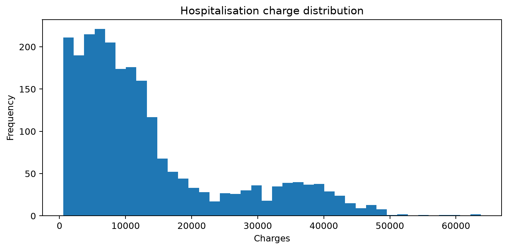
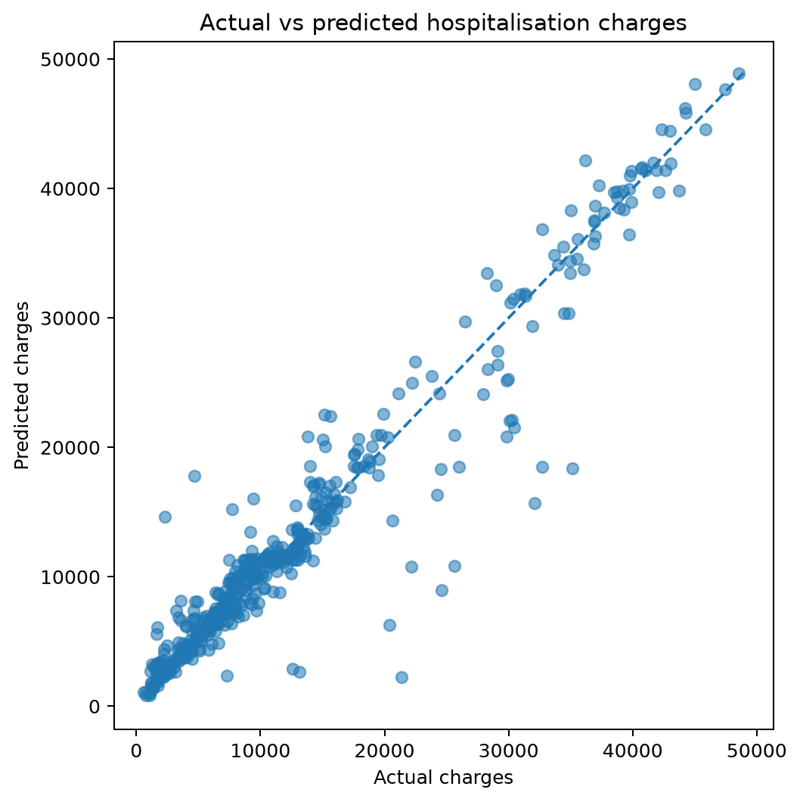
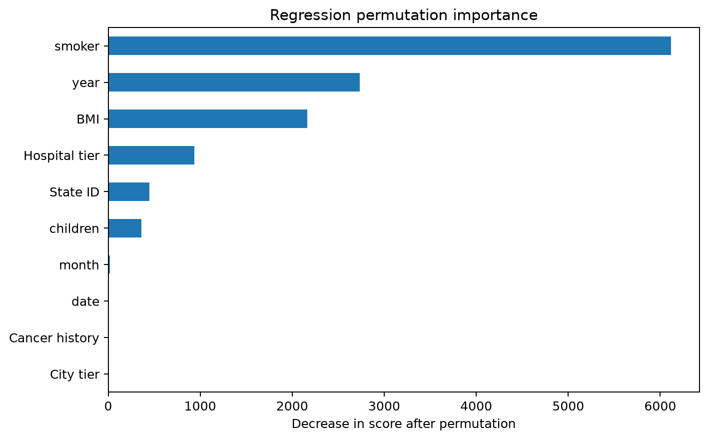
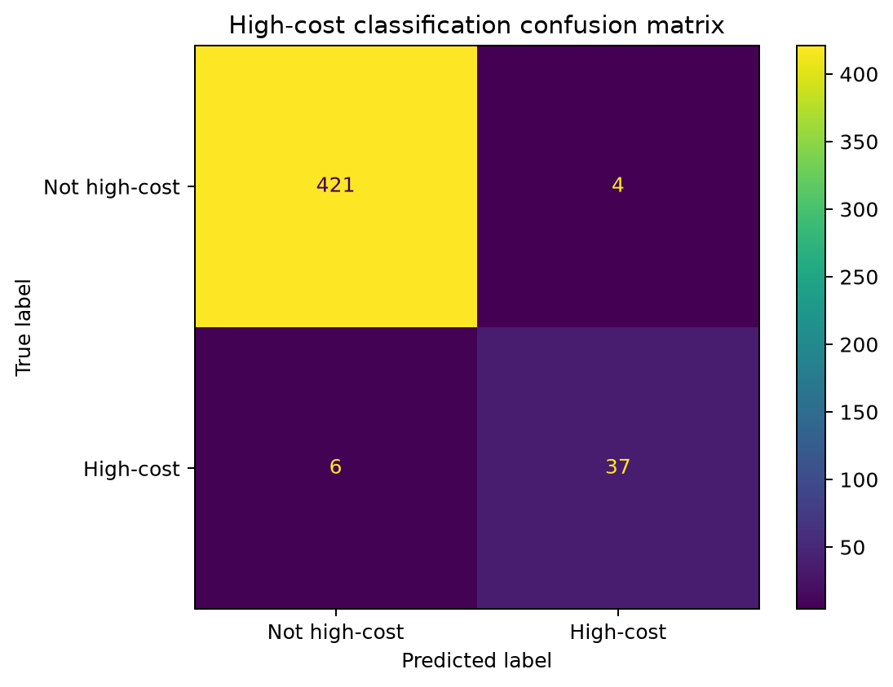
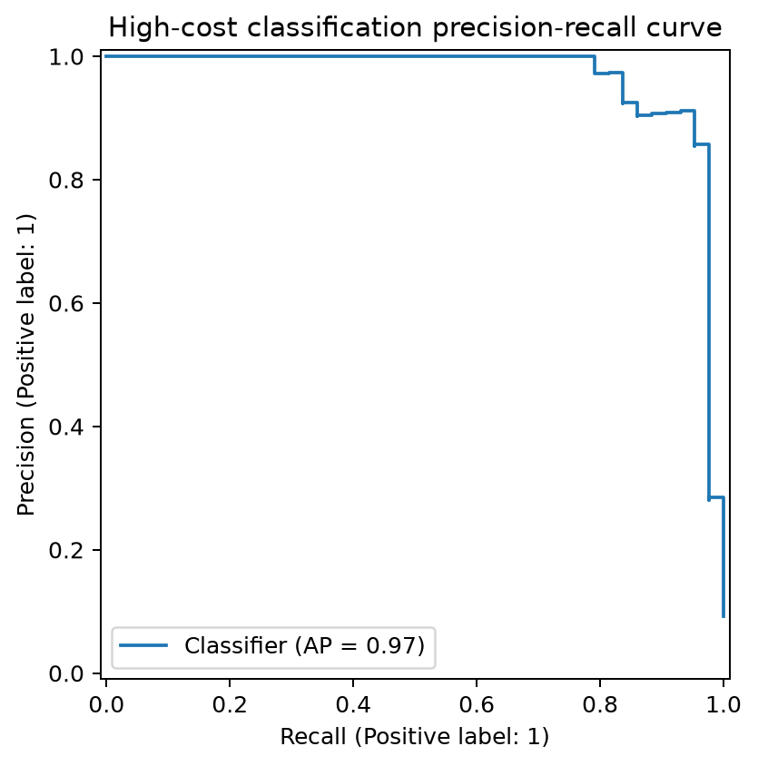
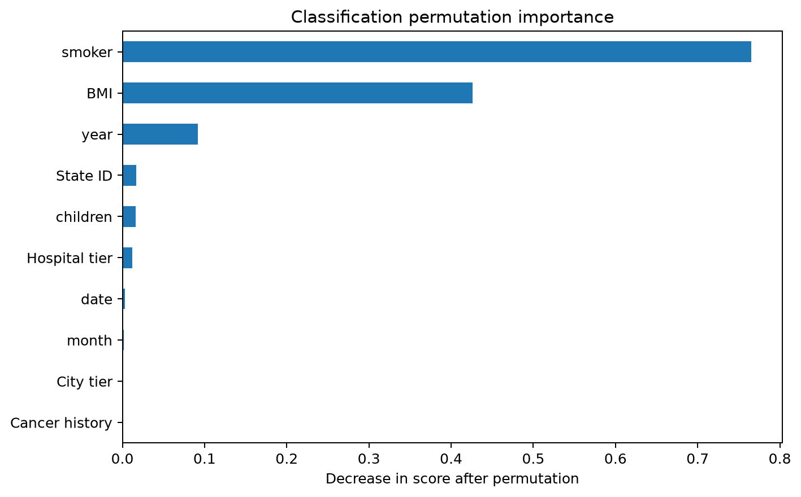

# Healthcare Insurance Risk Analysis

<p align="center">
  <strong>Machine learning for hospitalisation cost prediction and high-cost risk detection.</strong>
</p>

<p align="center">
  
  
  
</p>

---

## Overview

This project uses hospitalisation and medical examination data for two tasks:

1. Predict hospitalisation charges.
2. Identify cases in the highest-cost 10%.

The same customer never appears in both train and test sets. The final test set is kept separate during preprocessing, threshold selection, and model comparison.

> This project is for machine learning analysis. It is not a clinical diagnosis system.

## Results

| Task | Selected model | Main test result |
|---|---|---:|
| Cost regression | **Random Forest Regressor** | **R² = 0.926** |
| High-cost classification | **Histogram Gradient Boosting Classifier** | **PR-AUC = 0.968** |

Other test results:

- **Regression:** MAE = **1,661.85**, RMSE = **3,028.73**
- **Classification:** Precision = **0.902**, Recall = **0.860**, F1 = **0.881**, ROC-AUC = **0.993**
- **High-cost threshold:** **34,962.10**, calculated from the training data only

## Visual Results

The figures below are created by:

```bash
python -m scripts.generate_outputs
```

### Regression

<p align="center">
  
  
</p>

<p align="center">
  
</p>

### Classification

<p align="center">
  
  
</p>

<p align="center">
  
</p>

## Data

| Source | Rows | Main information |
|---|---:|---|
| Hospitalisation details | 2,343 | charges, date, children, hospital tier, city tier, state |
| Medical examinations | 2,335 | BMI, HBA1C, medical history, surgeries, smoking status |

A third source contains names. It is not used by the model and is not included in the public repository.

The two analytical CSV files are also not published here until their source and licence are clearly documented. `data/raw/README.md` lists the files needed to reproduce the project locally.

### Data issues handled

- repeated customer ID placeholder `?`
- hospitalisation rows without a matching medical examination
- unknown year and smoking values stored as `?`
- inconsistent labels such as `Yes`, `yes`, and `No`
- surgery counts stored as text

Unknown values stay missing. They are not replaced with invented values.

## Workflow

```text
Raw data
   ↓
Schema and join checks
   ↓
Cleaning and type conversion
   ↓
Grouped train/test split by Customer ID
   ↓
Preprocessing fitted on training data
   ↓
┌──────────────────────┬─────────────────────────┐
│ Cost regression      │ High-cost classification│
└──────────────────────┴─────────────────────────┘
   ↓
5-fold grouped cross-validation
   ↓
Final test evaluation
   ↓
Error analysis and permutation importance
```

Imputation, encoding, scaling, model selection, and the high-cost threshold use training data only.

## Models

### Cost Regression

Models compared:

- Mean baseline
- Ridge Regression
- Random Forest Regressor
- Histogram Gradient Boosting Regressor
- Histogram Gradient Boosting with log-transformed target

Selected model: **Random Forest Regressor**

| Metric | Test result |
|---|---:|
| MAE | **1,661.85** |
| RMSE | **3,028.73** |
| R² | **0.926** |

### High-Cost Classification

Models compared:

- Prior-probability baseline
- Logistic Regression
- Random Forest Classifier
- Histogram Gradient Boosting Classifier

Selected model: **Histogram Gradient Boosting Classifier**

| Metric | Test result |
|---|---:|
| Precision | **0.902** |
| Recall | **0.860** |
| F1 | **0.881** |
| ROC-AUC | **0.993** |
| PR-AUC | **0.968** |

PR-AUC and recall are useful here because high-cost cases are rare.

## Notebooks

| Notebook | Purpose |
|---|---|
| `01_data_understanding.ipynb` | inspect the sources, columns, IDs, and joins |
| `02_data_quality_and_cleaning.ipynb` | clean the data and build the analytical dataset |
| `03_exploratory_analysis.ipynb` | explore charges and main data patterns |
| `04_feature_engineering.ipynb` | prepare features and preprocessing |
| `05_cost_regression.ipynb` | compare regression models and evaluate the final model |
| `06_high_cost_classification.ipynb` | define the high-cost target and compare classifiers |
| `07_model_explainability_and_error_analysis.ipynb` | inspect errors and feature importance |

The reusable code is in `src/`. The notebooks focus on the analysis and results.

## Repository Structure

```text
Healthcare-Insurance-Risk-Analysis/
├── data/raw/README.md
├── notebooks/
├── outputs/
│   ├── figures/
│   └── metrics/
├── scripts/
│   └── generate_outputs.py
├── src/
├── tests/
├── requirements.txt
└── README.md
```

## Run Locally

Place the two CSV files listed in `data/raw/README.md` inside `data/raw/`.

Then run:

```bash
python -m venv .venv
source .venv/bin/activate  # Windows: .venv\\Scripts\\activate
pip install -r requirements.txt
pytest -q
python -m scripts.generate_outputs
jupyter notebook
```

`generate_outputs.py` rebuilds the analytical dataset, runs the models, and saves the figures and metrics in `outputs/`.

Run notebooks `01` to `07` in order for the full analysis.

## Limits

- The dataset is small.
- Some hospitalisation rows have no matching medical examination.
- Feature importance shows predictive value, not cause and effect.
- The results would need external validation before use on real insurance populations.

## Stack

**Python · pandas · NumPy · scikit-learn · Matplotlib · Jupyter · pytest · GitHub Actions**
